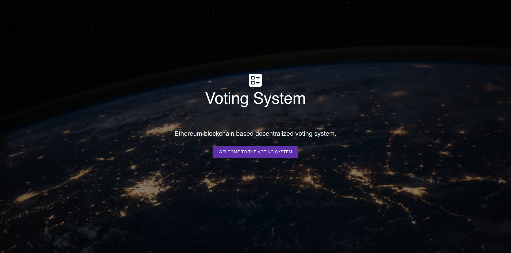
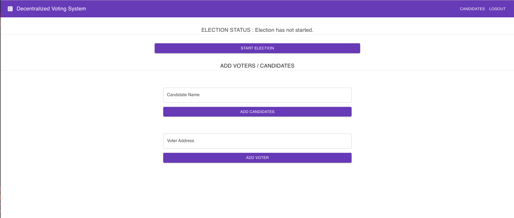
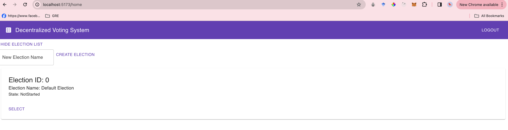
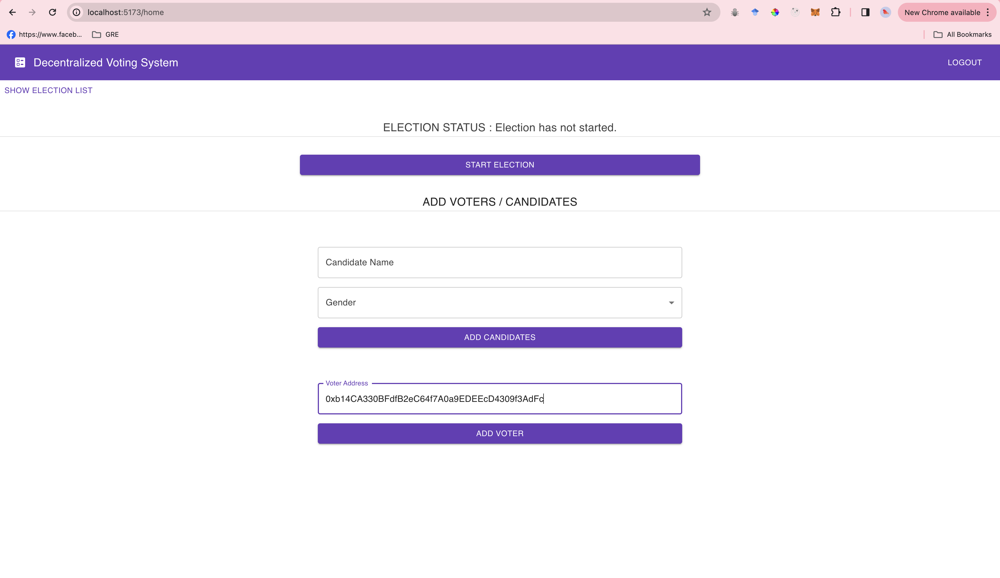
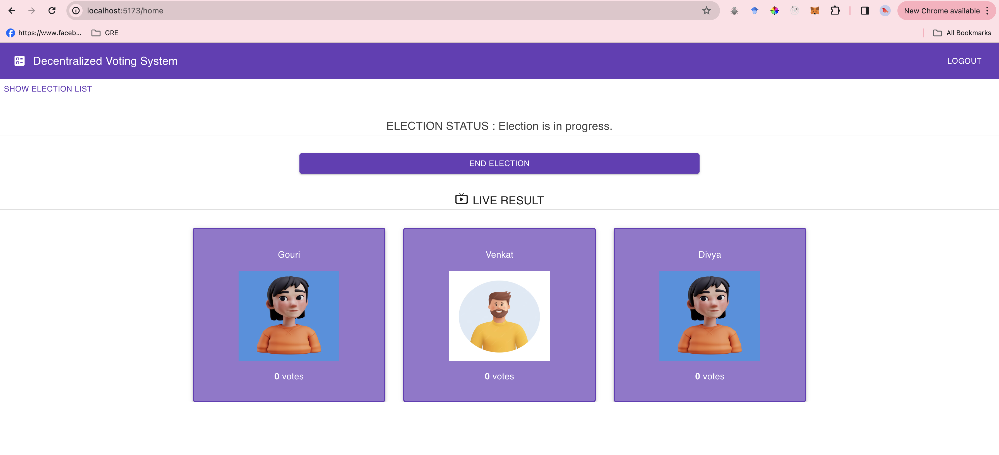
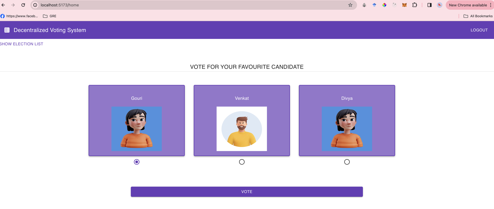
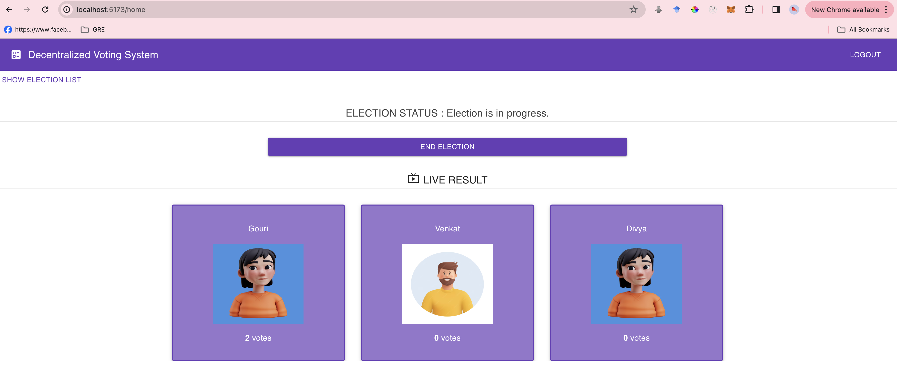
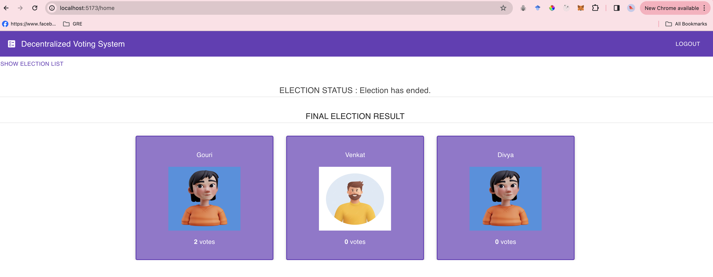
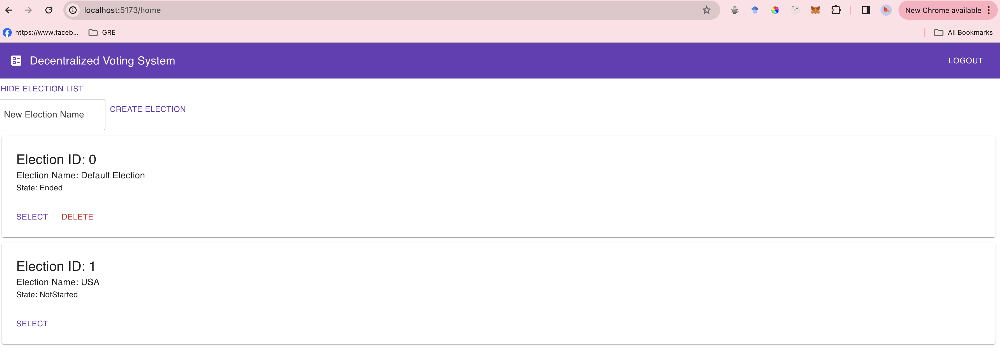

## `Decentralized Voting System - CPSC 559 Advanced Blockchain Technology`

<p>Decentralized voting system provides a voting mechanism by utilizing blockchain technology to conduct elections and decision making processes in a decentralized manner.
<p>In these kinds of voting systems, the voting process is distributed across a network of computers in a decentralized manner instead of having a single entity to control the voting. This mechanism ensures that no single entity can control the outcome of the voting.


## Team Members:
1. Gouri Babasaheb Sabale:  (CWID: 885189761) (Email: gourisabale123@csu.fullerton.edu)
2. Divya Tanwar (CWID:885207738 (Email: divyatanwar@csu.fullerton.edu))
3. Venkat Jawahar Reddy Yerrabathini (CWID: 885187195) (Email: yvjr95@gmail.com)

## Link to the Github Project:
     https://github.com/tanwardivya/decentralized-voting-system.git


## Key Attributes:

1. **Secure Decentralized Voting:** Conduct voting process securely with complete confidence. Advanced Blockchain technology leverages decentralized storage to ensure the transparency and security of votes, eliminating vote manipulation and single entity of control.

2. **Security:** By incorporating security, we will ensure that votes of the users cannot be altered or deleted once recorded on the blockchain network.

3. **Immutability:** The decentralized voting system will ensure that the votes once recorded will be immutable and cannot be changed.

4. **Smart Contract Integration:** We will use smart contracts to automate voting mechanisms which involve voter registration, candidate registration, voter counting, declare winners etc.


## Main Features:

1. **Add Candidates:** Using this feature, owner of the Election add candidates
2. **Add Voters:** Using this feature, owner of the Election add voters
3. **Start Election:** Using this feature , owner can start the election
4. **End Election:** Using this feature , owner can end the election
5. **Add multiple Elections:** Using this feature , owner can add multiple elections
6. **Election Dashboard to view the status of all Elections:** Using this feature , owner as well as voter can see multiple elections statuses
7. **Vote for the candidates:** Using this feature , voter can vote for the candidates
8. **Handle Tie Situations:** This feature is introduced to handle ties in the elections by choosing winner randomly
9. **Declare Winner:** With this feature , we can declare the final winner of the current election
10.**Get Candidate Details:** This feature helps to fetch candidate details


## Requirments:

- ReactJS
- Metamask
- Ganache
- Solidity
- Node 18.2.0


## Setting Up the Project Enviorment:

- Install Metamask wallet using chromium extentions
- Install Node.js
- Install Ganache

### Steps to run the Project:

1. Clone the project

```bash
cd decentralized-voting-system
git clone https://github.com/tanwardivya/decentralized-voting-system
```

2. Start Ganache

Open the Ganache GUI client to start the local blockchain instance.

3. Compile & Deploy Election Smart Contract

```bash
truffle compile
truffle migrate
```

Note: We must migrate the election smart contract each time restart ganache.

4. Configure Metamask

- Unlock Metamask
- Connect metamask to the local Etherum blockchain provided by Ganache.
- Import an account provided by Ganache.

5. Run the Front End Application

```bash
cd voting-dapp
npm install
npm run dev
```

Visit URL in your browser: <http://localhost:5173>


##  Metamask Connection:

      Use account private key and import it to metamask.
      For the "Network Name" field enter "localhost".
      For the "New RPC URL" field enter "http://127.0.0.1:7545".
      For the chain ID enter "1337". Then click save.

## Screenshots:

Landing page:
 &nbsp;
Admin page:
 &nbsp;
Select Election:
 &nbsp;
Add Voter:
 &nbsp;
View Candidate:
 &nbsp;
Voting Page:
 &nbsp;
Election Progress:
 &nbsp;
Election Result:
 &nbsp;
Creating a election:
 &nbsp;


## References:

https://docs.soliditylang.org/en/develop/solidity-by-example.html
https://github.com/ashishlamsal/voting-dapp